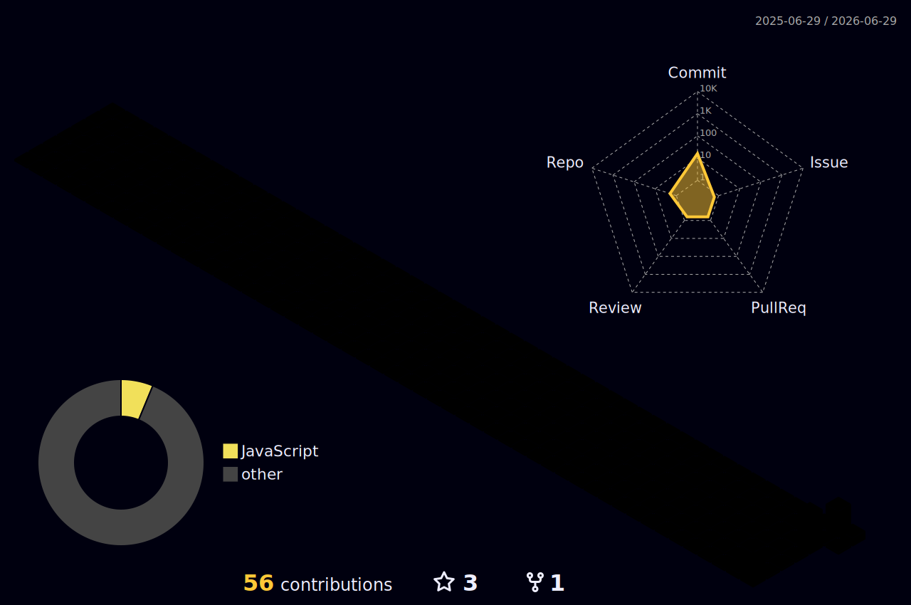

<!-- ═════════════════════════ HERO HEADER ═════════════════════════ -->


<br/>

<div align="center">

<!-- ─── Typing SVG Animation ─── -->
[](https://git.io/typing-svg)

<br/>

<!-- ─── Stats Badges ─── -->

&nbsp;

&nbsp;


</div>

<br/>

---

<!-- ═════════════════════════ ABOUT ME ═════════════════════════ -->

## 👨‍💻 About Me

```bash
┌──────────────────────────────────────────────────────────┐
│                                                          │
│   raj@linux:~$ cat about_me.txt                          │
│                                                          │
│   Name      : Raj Tamboli                                │
│   Role      : B.Tech Computer Engineering (3rd Year)     │
│   Core      : Java • Spring Boot • Python • C/C++ • JS   │
│   Specialty : Backend Dev • Bash/Shell • Networking      │
│   Shell     : Bash 5.x on Linux  (yes, btw I use Linux)  │
│   Email     : rajtamboli.0026@gmail.com                  │
│   Status    : Learning → Building → Improving → Repeat   │
│                                                          │
└──────────────────────────────────────────────────────────┘
```

- 🎓 **3rd Year B.Tech Computer Engineering Student**
- ☕ **Java (Spring Boot) & Python Developer** — backend is my playground
- 💻 **Proficient in C, C++, HTML5, CSS & JavaScript**
- 🐧 **Bash & Shell Scripting Pro** — automation is life
- 🌐 **Linux Power User | Networking Savvy** — from protocols to subnetting
- 🤖 **Dreaming to be FullStack Java Developer**
- 🚀 **Always learning, always building, always shipping**
- 📬 Reach me: **tamboliraj.7870@gmail.com**

---

<!-- ═════════════════════════ CURRENT PROJECTS ═════════════════════════ -->

## 🚧 Current Projects

> 🔭 Always building something new — check out my pinned repos!

| 🏗️ Project | 📝 Description | 🔗 |
|:-----------|:--------------|:---|
| **AI Story Teller: From Text to Visual Tales** | *Video, Audio, With Interactive Stories* | [→ View Repo](https://github.com/RAJ0026/Ai_Story_Generator_Visual_Audio.git) |
| **Upcoming Project** | *(description)* | [→ View Repo](https://github.com/RAJ0026) |
| **Upcoming Project** | *(description)* | [→ View Repo](https://github.com/RAJ0026) |

---

<!-- ═════════════════════════ CURRENTLY LEARNING ═════════════════════════ -->

## 📚 Currently Learning

<div align="center">


</div>

---
<!-- ═════════════════════════ Tech Stack ═════════════════════════ -->
<table>
  <tr>
    <td width="50%">
      <h3 style="font-family: 'Roboto Mono', 'Source Code Pro', monospace; font-weight: 600; letter-spacing: 1px; color: #00d4ff; border-bottom: 2px solid #00d4ff; padding-bottom: 5px;">💻 Programming Languages :-</h3>
      <p>
        
        
        
        
        
        
      </p>
    </td>
    <td width="50%">
      <h3 style="font-family: 'Roboto Mono', 'Source Code Pro', monospace; font-weight: 600; letter-spacing: 1px; color: #00d4ff; border-bottom: 2px solid #00d4ff; padding-bottom: 5px;">🎨 Frontend Development :-</h3>
      <p>
        
        
        
        
      </p>
    </td>
  </tr>
  <tr>
    <td width="50%">
      <h3 style="font-family: 'Roboto Mono', 'Source Code Pro', monospace; font-weight: 600; letter-spacing: 1px; color: #00d4ff; border-bottom: 2px solid #00d4ff; padding-bottom: 5px;">🔧 Backend Development :-</h3>
      <p>
        
        
        
        
      </p>
    </td>
    <td width="50%">
      <h3 style="font-family: 'Roboto Mono', 'Source Code Pro', monospace; font-weight: 600; letter-spacing: 1px; color: #00d4ff; border-bottom: 2px solid #00d4ff; padding-bottom: 5px;">🗄️ Databases :-</h3>
      <p>
        
        
      </p>
    </td>
  </tr>
  <tr>
    <td width="50%">
      <h3 style="font-family: 'Roboto Mono', 'Source Code Pro', monospace; font-weight: 600; letter-spacing: 1px; color: #00d4ff; border-bottom: 2px solid #00d4ff; padding-bottom: 5px;">☁️ Cloud & DevOps :-</h3>
      <p>
        
        
        
        
      </p>
    </td>
    <td width="50%">
      <h3 style="font-family: 'Roboto Mono', 'Source Code Pro', monospace; font-weight: 600; letter-spacing: 1px; color: #00d4ff; border-bottom: 2px solid #00d4ff; padding-bottom: 5px;">🛠️ Tools & Platforms :-</h3>
      <p>
        
        
        
        
        
        
      </p>
    </td>
  </tr>
</table>

---
<br>
</br>
<!-- ═════════════════════════ TROPHIES ═════════════════════════ -->

## 🏆 GitHub Trophies

<div align="center">

[](https://github.com/ryo-ma/github-profile-trophy)

</div>

---
<br>
</br>
<!-- ═════════════════════════ 3D CONTRIBUTION GRAPH ═════════════════════════ -->

## 🌐 3D Contribution Calendar

<div align="center">

[](https://github.com/yoshi389111/github-profile-3d-contrib)

</div>

---

<!-- ═════════════════════════ DEV QUOTE ═════════════════════════ -->

## 💬 Dev Quote of the Day

<div align="center">


</div>

---

<!-- ═════════════════════════ SNAKE ANIMATION ═════════════════════════ -->

## 🐍 Contribution Snake

<div align="center">

<picture>
  <source media="(prefers-color-scheme: dark)"
          srcset="https://raw.githubusercontent.com/RAJ0026/RAJ0026/output/github-contribution-grid-snake-dark.svg">
  <source media="(prefers-color-scheme: light)"
          srcset="https://raw.githubusercontent.com/RAJ0026/RAJ0026/output/github-contribution-grid-snake.svg">
  
</picture>

</div>

---
<br>
</br>
<!-- ═════════════════════════ CONNECT ═════════════════════════ -->

## 🌐 Let's Connect!

<div align="center">

[](https://linkedin.com/in/raj-tamboli)
[](https://twitter.com/@26Tamboli)
[](mailto:rajtamboli.0026@gmail.com)
[](https://github.com/RAJ0026)

</div>

<br/>

<div align="center">
  <i>💡 Open to Internships, collabs & open-source contributions — let's build together!</i>
</div>

---

<!-- ═════════════════════════ FOOTER WAVE ═════════════════════════ -->


<div align="center">
  <sub>⭐ Drop a star if you find something useful &nbsp;</sub>
</div>
